# 🎮 Game Store Application

A full-featured, console-based Java application for managing a game store, demonstrating core Java, Object-Oriented Programming (OOP) principles, XML data persistence, and interactive CLI interfaces.

---

## 📋 Project Overview

This application simulates a complete Game Store management ecosystem:
* **Game Catalog Management**: Multi-platform games (PC, Console, Mobile) with search by title/genre and sorting by price/rating.
* **Player Tier Accounts**: `RegularPlayer` and `VIPPlayer` with configurable discounts and strict exception handling.
* **Shopping Cart & Orders**: Dynamic order building, polymorphic price and discount calculations, and receipt generation.
* **Tournament System**: Single-elimination tournament match simulation with random outcomes, bye support, and winner determination.
* **XML Data Persistence**: Save and reload store data (`games.xml`, `players.xml`, `orders.xml`, `tournaments.xml`) using DOM XML parsers.
* **Interactive Terminal CLI**: Menu-driven interface using `Scanner` with crash-prevention input validation.

---

## 📊 Class Diagram

```mermaid
classDiagram
    direction TB

    class Genre {
        <<enum>>
        ACTION
        ADVENTURE
        RPG
        SPORTS
        STRATEGY
        PUZZLE
        SIMULATION
        HORROR
        +getDisplayName() String
    }

    class OrderStatus {
        <<enum>>
        PENDING
        CONFIRMED
        CANCELLED
        +getDisplayName() String
    }

    class Searchable~T~ {
        <<interface>>
        +searchByName(String) List~T~
        +searchByGenre(Genre) List~T~
    }

    class GameStoreException {
        +GameStoreException(String)
    }
    GameStoreException --|> RuntimeException

    class InvalidPriceException
    class InvalidRatingException
    class TournamentFullException
    class DuplicateRegistrationException
    class EmptyOrderException
    class IneligibleDiscountException

    InvalidPriceException --|> GameStoreException
    InvalidRatingException --|> GameStoreException
    TournamentFullException --|> GameStoreException
    DuplicateRegistrationException --|> GameStoreException
    EmptyOrderException --|> GameStoreException
    IneligibleDiscountException --|> GameStoreException

    class Game {
        <<abstract>>
        -int id
        -String name
        -double price
        -Genre genre
        -double rating
        +getPlatform() String*
    }

    class PCGame {
        -String operatingSystem
        +getPlatform() String
    }

    class ConsoleGame {
        -String platform
        +getPlatform() String
    }

    class MobileGame {
        -boolean freeToPlay
        +getPlatform() String
    }

    Game <|-- PCGame
    Game <|-- ConsoleGame
    Game <|-- MobileGame
    Game --> Genre

    class Player {
        <<abstract>>
        -int id
        -String name
        -String email
        -double discount
        +getPlayerType() String*
        +setDiscount(double)
    }

    class RegularPlayer {
        +setDiscount(double) [throws IneligibleDiscountException]
        +getPlayerType() String
    }

    class VIPPlayer {
        +getPlayerType() String
    }

    Player <|-- RegularPlayer
    Player <|-- VIPPlayer

    class Order {
        -int id
        -Player player
        -List~Game~ games
        -OrderStatus status
        +calculateTotal() double
        +checkout()
    }

    Order --> Player
    Order --> "0..*" Game
    Order --> OrderStatus

    class Tournament {
        -int id
        -String name
        -int maxPlayers
        -List~Player~ participants
        -Player winner
        +registerPlayer(Player)
        +startTournament()
    }

    Tournament --> "0..*" Player

    class GameStore {
        -List~Game~ games
        -List~Player~ players
        -List~Order~ orders
        -List~Tournament~ tournaments
        +addGame(Game)
        +addPlayer(Player)
        +createOrder(Player)
        +createTournament(String, int)
        +sortByPrice()
        +sortByRating()
        +syncNextIds()
    }

    GameStore ..|> Searchable~Game~

    class DataManager {
        <<utility>>
        +saveData(GameStore, String)
        +loadData(GameStore, String)
    }

    class ConsoleMenu {
        -GameStore store
        -Scanner scanner
        -String dataDir
        +start()
    }

    ConsoleMenu --> GameStore
    ConsoleMenu ..> DataManager
```



---

## 🏗️ Project Architecture & File Map

```text
src/main/java/org/example/
├── Main.java                              # App Launcher & boot sequence
│
├── enums/
│   ├── Genre.java                         # 8 Game genres (ACTION, RPG, SPORTS, etc.)
│   └── OrderStatus.java                   # Lifecycle states (PENDING, CONFIRMED, CANCELLED)
│
├── interfaces/
│   └── Searchable.java                    # Generic catalog search contract
│
├── exception/
│   ├── GameStoreException.java            # Base exception for store domain errors
│   ├── InvalidPriceException.java         # Price < 0 validation
│   ├── InvalidRatingException.java        # Rating outside 0.0–5.0 validation
│   ├── TournamentFullException.java       # Tournament capacity validation
│   ├── DuplicateRegistrationException.java # Duplicate player registration check
│   ├── EmptyOrderException.java           # Empty shopping cart checkout check
│   └── IneligibleDiscountException.java   # Non-VIP discount assignment prevention
│
├── model/
│   ├── game/
│   │   ├── Game.java                      # Abstract base game model
│   │   ├── PCGame.java                    # PC platform subclass (OS)
│   │   ├── ConsoleGame.java               # Console platform subclass (Platform)
│   │   └── MobileGame.java               # Mobile platform subclass (Free-to-play flag)
│   │
│   ├── player/
│   │   ├── Player.java                    # Abstract base player model (configurable discount)
│   │   ├── RegularPlayer.java             # Standard tier (0% discount enforced)
│   │   └── VIPPlayer.java                 # Premium tier (configurable discount rates)
│   │
│   ├── order/
│   │   └── Order.java                     # Shopping cart with polymorphic checkout
│   │
│   └── tournament/
│       └── Tournament.java                # Single-elimination tournament bracket engine
│
├── service/
│   └── GameStore.java                     # Central store service & search/sort manager
│
├── data/
│   └── DataManager.java                   # DOM XML serialization & deserialization utility
│
└── ui/
    └── ConsoleMenu.java                   # Interactive terminal user interface
```

---

## 🧩 Key Implemented Features Across All 7 Phases

### Phase 1 — Architecture Foundation
* Custom exceptions extending `GameStoreException` → `RuntimeException`.
* Type-safe Enums (`Genre`, `OrderStatus`) with case-insensitive conversion.
* Generic interface `Searchable<T>`.

### Phase 2 — Core Domain Models
* **Game Hierarchy**: Abstract `Game` base class extended by `PCGame`, `ConsoleGame`, and `MobileGame`.
* **Player Hierarchy**: Abstract `Player` base class extended by `RegularPlayer` and `VIPPlayer`.

### Phase 3 — Business Logic & Polymorphic Discounts
* Configurable discounts owned by `Player` base class and polymorphically applied in `Order.calculateTotal()`.
* Strict discount restriction: `RegularPlayer` throws `IneligibleDiscountException` if assigned a discount `> 0`.
* Tournament bracket elimination engine with randomized match resolution and auto-byes.

### Phase 4 — Service Layer (`GameStore`)
* Centralized manager handling entity registration, auto-increment ID generation, catalog searching (Title/Genre), and sorting (Price/Rating).

### Phase 5 — XML Data Persistence (`DataManager`)
* Serializes and deserializes application state to/from formatted XML files (`games.xml`, `players.xml`, `orders.xml`, `tournaments.xml`) using standard Java DOM parsers.
* Restores entity graphs, links IDs, and resynchronizes auto-increment counters.

### Phase 6 — Interactive Terminal UI (`ConsoleMenu`)
* Full menu-driven interactive terminal interface using `Scanner`.
* Complete user management: Register Regular/VIP players, upgrade Regular players to VIP, reconfigure VIP discounts.
* Crash-proof input sanitization (`readInt`, `readDouble`, `readNonEmptyString`).

### Phase 7 — Final Polish & Verification
* Full end-to-end testing, exit auto-save, and complete repo documentation.

---

## ⚙️ Prerequisites & Execution

### Requirements
* **Java 26** (or OpenJDK 21+)
* No external third-party libraries required (built using standard Java JDK APIs).

### Compile the Application
```powershell
& "C:\Users\Youssef\.jdks\openjdk-26.0.2.1\bin\javac.exe" -d target/classes -sourcepath src/main/java (Get-ChildItem -Path src/main/java -Recurse -Filter *.java | ForEach-Object { $_.FullName })
```

### Run the Interactive Terminal Application
```powershell
& "C:\Users\Youssef\.jdks\openjdk-26.0.2.1\bin\java.exe" -classpath "target/classes" org.example.Main
```

---

## 💻 Sample CLI Terminal Walkthrough

```text
╔════════════════════════════════════════════════════════════════╗
║            🎮 WELCOME TO GAME STORE MANAGEMENT CLI             ║
╚════════════════════════════════════════════════════════════════╝
[SYSTEM] Checking for existing persistent data in 'data/'...
[SYSTEM] Loaded 6 games, 5 players, 3 orders, and 2 tournaments from XML!

╔════════════════════════════════════════════════════════════════╗
║                          MAIN MENU                             ║
╚════════════════════════════════════════════════════════════════╝
  1. 🎮 Game Catalog & Inventory
  2. 👤 Player Management & VIP Upgrades
  3. 🛒 Shopping Orders & Checkout
  4. 🏆 Tournaments & Match Simulation
  5. 💾 Save / Reload Store Data (XML)
  0. 🚪 Exit Application

Select an option [0-5]: 
```
